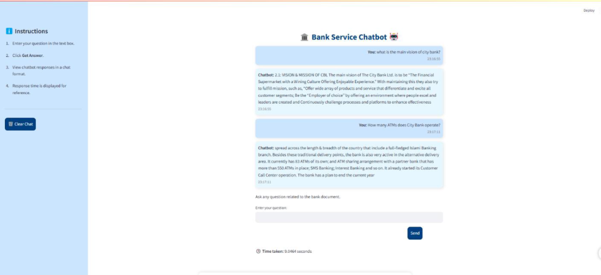
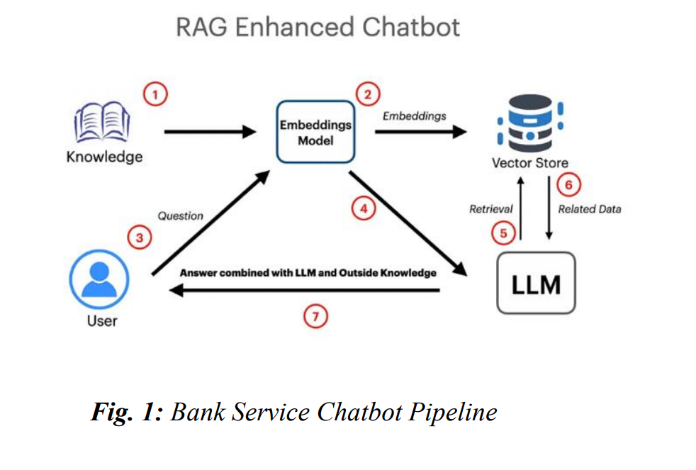

# Bank Service Chatbot
Bank Service Chatbot typically answers any query related to the City Bank to the user. It is built using Retrieval Augmented Generation(RAG) and Large Language Model(LLM), specifically llama 3b version. To automate the banking service of the real-world, this chatbot provide means to interact with the user in a more advanced way therefore providing more accurate and faster responses.

## Table of Contents
- Description
- Features
- Requirements
- Getting Started
- Project Structure
- Software Used
- Dependencies
- User
- License
- Acknowledgement
- Presentation File
- Video File

## Description
Bank Service Chatbot is built using Retrieval Augmented Generation(RAG) and Large Language Model(LLM). It solely uses a pdf of City Bank as its data source to answer queries. 

Recently, the integration of artificial intelligence (AI) into customer service systems has significantly improved the accessibility of services in various industries. Particularly, the banking sector has been seen to shift towards AI-based chatbots that can handle customer queries and provide instant responses. Traditional methods of customer support, such as call centers and email support, often led to long wait times and customer dissatisfaction. In order to address these challenges, this paper explores the development of an intelligent Bank Service Chatbot that provides a faster response to customers with the help of Retrieval-Augmented Generation (RAG) with a Large Language Model (LLM), specifically Ollama’s Llama 3 (3B).

This project supports both RAG & ChromaDB as a vector database for efficient information retrieval. RAG models have the ability to retrieve relevant information from an external knowledge base to generate precise responses. The chatbot can provide answers based on the bank’s policies, procedures, and services by processing PDF-based bank documents. This approach reduces operational costs and enhances customersupport.

The User Interface (UI) is implemented using Streamlit, allowing the users to interact with the chatbot. Upon receiving a query, the system retrieves relevant information from the database and generates a response through the Llama 3 model.

The Language Model (LLM), Ollama Llama 3, processes the retrieved information and generates natural language responses to user queries.

Finally, the Information Retrieval (IR) System (ChromaDB) is responsible for storing the bank’s documents and providing fast and efficient retrieval of relevant data based on user queries.

Below is the UI design of the chatbot.



## Features
- <b>User Query:</b> User can pass any query and the bot will generate a reponse.
- <b>Chat History:</b> The chat history between the user and the bot is saved unless the user wishes to clear it.
- <b>Clear Chat Button:</b> User can clear the chat history if wishes to.
  
## Requiremetn
- ollama==0.4.4
- pdfplumber==0.11.4
- langchain==0.3.14
- langchain-core==0.3.29
- langchain-ollama==0.2.2
- langchain_community==0.3.14
- langchain_text_splitters==0.3.5
- unstructured>=0.16.12
- unstructured[all-docs]>=0.16.12
- onnx>=1.17.0
- protobuf==5.29.2
- chromadb>=0.4.22
- Pillow==10.4.0
- numpy==1.26.4
- pytest==7.4.4
- pytest-cov==4.1.0
- coverage==7.4.0
- pydantic==2.10.4
- streamlit==1.42.2
- pandas
- nltk
- rouge

## Getting Started

<b>Installation</b>

1. Clone the Repository:
```bash
git clone https://github.com/suhanaislam52/Bank-Service-Chatbot.git
cd Bank-Service-Chatbot
```

2. Create a Virtual Environment
```bash
python -m venv venv
source venv/bin/activate  # On Windows: venv\Scripts\activate
```

3. Install Dependencies
```bash
pip install -r requirements.txt
```

4. Pull llama
```bash
pip install transformers accelerate torch
```

```bash
pip install huggingface_hub
huggingface-cli login
```

5. Install Streamlit
```bash
pip install streamlit
```

6. Run the Chabot
```bash
streamlit run chatbot.py
```

7. Test the Automation Test Script
```bash
python automation_script.py
```


## Project Structure
Bank-Service-Chatbot/
├── actions.py               # Defines custom actions executed by the chatbot
├── chatbot.py               # Main script to initiate and run the chatbot
├── create_database.py       # Script to set up and initialize the database
├── automation_script.py     # Automates tasks such as document generation
├── testset.csv              # Dataset used for testing and validation
├── configs/                 # Configuration files for Rasa NLU and Core
│   ├── config.yml
│   └── credentials.yml
├── data/                    # Training data for intents and entities
│   ├── nlu.md
│   └── stories.md
├── models/                  # Stored trained models
│   └── (model files)
├── requirements.txt         # Lists all Python dependencies
├── Makefile                 # Contains commands for building and managing the project
└── README.md                # Project documentation


## Software Used
- Ollama
- Microsoft Build Tools for C++
- Visual Studio

## Dependencies
- Python version 3.12
- Llama 3b
- ChromaDB

## User
The interaction between the user and the chatbot takes place through the Streamlit interface. The system first performs a semantic search using the vector database to find chunks that are relevant to the query. Once the relevant chunks are identified, they are passed to the Llama 3 model, which generates a contextual answer based on the information retrieved. This response is then displayed to the user.

The MultiQueryRetriever was used to handle multiple queries in order to improve the efficiency and accuracy of retrieving information from the PDF by considering multiple queries at once.



## License
This project is licensed under the MIT License.See the LICENSE file for details.

## Acknowledgement
I would like to express our sincere gratitude to our supervisor, Shafin Rahman, of the Department of Computer Science, for his invaluable guidance and unwavering support throughout this project.


## Presentation File
You can download the presentation by clicking [here](https://github.com/suhanaislam52/Bank-Service-Chatbot/raw/main/Presentation/CSE299.8_Group07_Presentation_Slide.pptx).

(Note: Clicking "Raw" will download the file directly to your system.)

## Video File
You can download the video by clicking [here](https://github.com/suhanaislam52/Bank-Service-Chatbot/raw/main/Presentation/CSE299.8_VideoPresentation_by_group7.mp4).

(Note: Clicking "Raw" will download the file directly to your system.)
